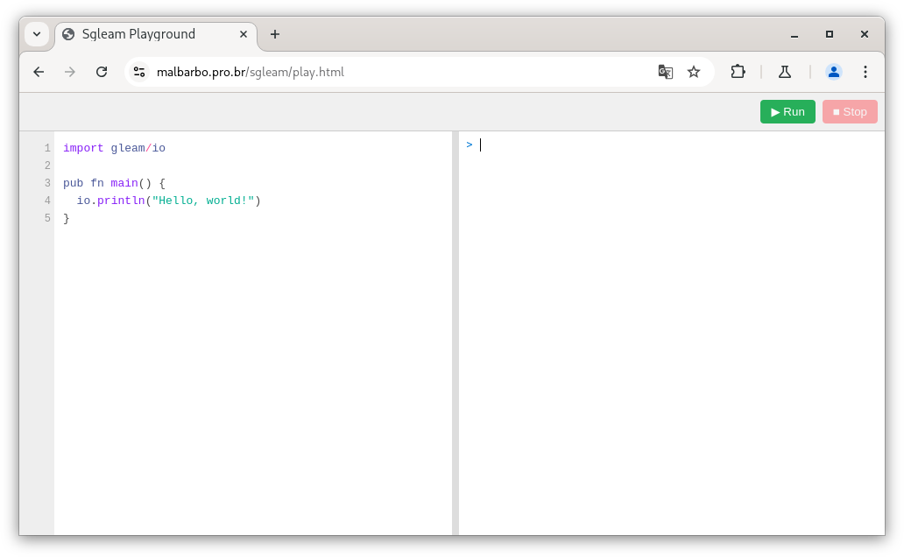

O que é?
========

## O que é?

O que é programação imperativa? \pause

- Um paradigma de programação onde os programas são descritos com sentenças que modificam o estado do programa. \pause

O que é programação funcional? \pause

- Um paradigma de programação onde os programas são descritos com aplicação e composição de funções. \pause

- Evita mudança de estado \pause (mudança do valor das variáveis) \pause

- Evita efeitos colaterais \pause (qualquer efeito que seja observável além do valor de saída da função, como a mudança dos parâmetro e variáveis global, exceções, entrada e saída, etc).


Por que?
========

## Por que?

Um paradigma (linguagem) de programação é uma ferramenta. \pause

Conhecer várias ferramentas permite utilizar a mais adequada para cada problema. \pause

Compartilhamento de dados junto com mudança de estado é difícil!


## Mudança de estado

<div class="columns">
<div class="column" width="50%">
Qual o valor de `lst`?

\small

```python
>>> lst = [0] * 3
>>> lst
[0, 0, 0]
>>> lst[1] = 10
>>> lst
```

\pause

```python
[0, 10, 0]
```

\pause

</div>
<div class="column" width="50%">
Qual o valor de `lst`?

\small

```python
>>> lst = [[]] * 3
>>> lst
[[], [], []]
>>> lst[1].append(2)
>>> lst
```

\pause

```python
[[2], [2], [2]]
```

</div>
</div>


## Mudança de estado

<div class="columns">
<div class="column" width="50%">

\small

```python
def adiciona_todos(
        dest: list[int],
        fonte: list[int]):
    '''
    Adiciona todos os elementos
    de *fonte* no final
    de *dest*.
    '''
    for x in fonte:
        dest.append(x)
```

\pause

</div>
<div class="column" width="50%">

Qual o valor de `lst`?

\small

```python
>>> lst = [4, 3, 1]
>>> adiciona_todos(lst, [6, 2])
>>> lst
```

\pause

```python
[4, 3, 1, 6, 2]
```

\pause

```python
>>> adiciona_todos(lst, lst)
>>> lst
```

\pause

A execução não para!

</div>
</div>


## Efeitos colaterais

As duas definições a seguir são equivalentes?

\small

```python
def soma_indices(lst: list[int], a: int, b: int) -> int:
    return indice(lst, b) + indice(lst, a)

def soma_indices(lst: list[int], a: int, b: int) -> int:
    return indice(lst, a) + indice(lst, b)
```

\normalsize

\pause

Não é possível afirmar que as duas definições são equivalentes sem olhar o código da função `indice`. Se a função `indice` tem efeitos colaterais, então as definições podem não ser equivalentes.


## Efeitos colaterais

A possibilidade de efeitos colaterais **dificulta pensar localmente** sobre o funcionamento do código. \pause

A ausência de efeitos colaterais **permite pensar localmente** sobre o funcionamento do código.


Como?
=====

## Como?

1) Escolher uma linguagem. \pause

2) Estudar as construções do paradigma e as referências da linguagem. \pause

3) Praticar lendo e escrevendo código.


## Como?

1) Escolher uma linguagem \pause

   - Student Gleam \pause

   - Simples \pause

   - Bom suporte ao paradigma funcional

   - Inferência de tipo

   - Fácil instalação


## Como?

2) Estudar as construções do paradigma e as referências da linguagem \pause

   - [A Tutorial Introduction to the Lambda Calculus](http://www.inf.fu-berlin.de/lehre/WS03/alpi/lambda.pdf)

   - Livro [How to Design Programs](http://htdp.org/)

   - Livro [Structure and Interpretation of Computer Programs](https://web.mit.edu/6.001/6.037/sicp.pdf)

   - [Tour](https://tour.gleam.run/) da linguagem Gleam

   - [Documentação](https://hexdocs.pm/gleam_stdlib/) da biblioteca padrão da linguagem Gleam

   - [Página](https://malbarbo.pro.br/sgleam/) do sgleam


## Como?

3) Praticar lendo e escrevendo código \pause

   - Muitos exemplos \pause

   - Muitos exercícios


Primeiros passos
================

## Instalação local

No Linux

\small

```console
$ curl -s -L https://malbarbo.pro.br/sgleam/sgleam.tar.gz | tar xvz
```

ou

```console
$ wget -qO- https://malbarbo.pro.br/sgleam/sgleam.tar.gz | tar xvz
```

\normalsize

Em outros sistemas

\small

Acesse <https://malbarbo.pro.br/sgleam/> e faça o download e descompactação manualmente.


## Web

{width=12cm}


## Execução

<div class="columns">
<div class="column" width="50%">
Considere o arquivo `dobro.gleam` com o conteúdo

\small

```gleam
import gleam/io

pub fn dobro(x: Int) -> Int {
  x * 2
}

pub fn main() {
  dobro(4)
}
```

\pause

</div>
<div class="column" width="50%">

Para executar o arquivo no Linux digite

```console
$ ./sgleam dobro.gleam
8
```

\pause

No Windows

```console
$ .\sgleam dobro.gleam
8
```

</div>
</div>


## Execução do repl

<div class="columns">
<div class="column" width="55%">

REPL (_Read Eval Print Loop_)

- A expressão é lida (_Read_)

- A expressão é avaliada (_Eval_)

- O resultado da avaliação é exibido (_Print_)

- O processo é repetido (_Loop_)

\pause

</div>
<div class="column" width="45%">
Para iniciar o repl

\small

```console
$ ./sgleam
Welcome to sgleam.
Type ctrl-d ou ":quit" to exit.
> 2 + 5
7
```

\pause

\normalsize

Para carregar um arquivo e iniciar o repl

\small

```console
$ ./sgleam -i dobro.gleam
Welcome to sgleam.
Type ctrl-d ou ":quit" to exit.
> dobro(4)
8
```

</div>
</div>


Leitura
=======

## Leitura

<div class="columns">
<div class="column" width="50%">

Recomendada

- [Tour da linguagem Gleam](https://tour.gleam.run/)

- [Programação funcional](https://en.wikipedia.org/wiki/Functional_programming)

</div>
<div class="column" width="50%">

Extra

- [The Python paradox](http://www.paulgraham.com/pypar.html)

- [Revenge of the Nerds](http://www.paulgraham.com/icad.html)

- [Beating the averages](http://www.paulgraham.com/avg.html)

</div>
</div>
