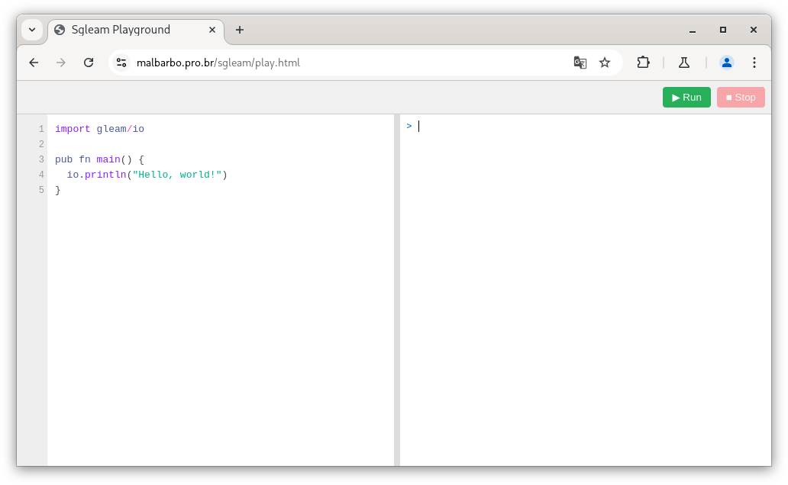

O que é?
========

## O que é?

O que é programação imperativa? \pause

- Um paradigma de programação em que os programas são descritos com sentenças que modificam o estado do programa. \pause

O que é programação funcional? \pause

- Um paradigma de programação em que os programas são descritos com aplicação e composição de funções. \pause

- Evita mudança de estado \pause (mudança do valor das variáveis) \pause

- Evita efeitos colaterais \pause (qualquer efeito que seja observável além do valor de saída da função, como a mudança dos parâmetros ou de variáveis globais, exceções, entrada e saída, etc.)


Por quê?
========

## Por quê?

Um paradigma (linguagem) de programação é uma ferramenta. \pause

Conhecer várias ferramentas permite utilizar a mais adequada para cada problema. \pause

Compartilhamento de dados com mudança de estado é difícil!


## Mudança de estado

<div class="columns">
<div class="column" width="50%">
Qual o valor de `lst`?

\small

```python
>>> lst = [0] * 3
>>> lst
[0, 0, 0]
>>> lst[1] = 10
>>> lst
```

\pause

```python
[0, 10, 0]
```

\pause

</div>
<div class="column" width="50%">
Qual o valor de `lst`?

\small

```python
>>> lst = [[]] * 3
>>> lst
[[], [], []]
>>> lst[1].append(2)
>>> lst
```

\pause

```python
[[2], [2], [2]]
```

</div>
</div>


## Mudança de estado

<div class="columns">
<div class="column" width="50%">

\small

```python
def adiciona_todos(
        dest: list[int],
        fonte: list[int]):
    '''
    Adiciona todos os elementos
    de *fonte* no final
    de *dest*.
    '''
    for x in fonte:
        dest.append(x)
```

\pause

</div>
<div class="column" width="50%">

Qual o valor de `lst`?

\small

```python
>>> lst = [4, 3, 1]
>>> adiciona_todos(lst, [6, 2])
>>> lst
```

\pause

```python
[4, 3, 1, 6, 2]
```

\pause

```python
>>> adiciona_todos(lst, lst)
>>> lst
```

\pause

A execução não para!

</div>
</div>


## Mudança de estado

Nas linguagens puramente funcionais, como o Gleam, não existe mudança de estado: depois de criado, um valor nunca muda. \pause

Sem mudança de estado, os problemas que acabamos de ver não existem.


## Efeitos colaterais

As duas definições a seguir são equivalentes?

\small

```python
def soma_indices(lst: list[int], a: int, b: int) -> int:
    return indice(lst, b) + indice(lst, a)

def soma_indices(lst: list[int], a: int, b: int) -> int:
    return indice(lst, a) + indice(lst, b)

# indice(lst, i) devolve o elemento de índice i de lst
```

\normalsize

\pause

Não é possível afirmar que as duas definições são equivalentes sem olhar o código da função `indice`. Se a função `indice` tem efeitos colaterais, então as definições podem não ser equivalentes.


## Efeitos colaterais

Mas nós não confiamos no propósito das funções? \pause

Sim, o propósito diz o que a função produz, mas nem sempre tudo que ela faz. \pause Com o tempo, um "jeitinho" para corrigir um problema rapidamente, como criar uma variável global, pode fazer o corpo divergir do propósito. \pause

A possibilidade de efeitos colaterais **dificulta pensar localmente** sobre o funcionamento do código. \pause

A ausência de efeitos colaterais **permite pensar localmente** sobre o funcionamento do código.


Como?
=====

## Como?

1) Escolher uma linguagem \pause

   - Gleam: simples, com bom suporte ao paradigma funcional e inferência de tipos \pause

   - Vamos usar o sgleam (_Student Gleam_), um interpretador de Gleam voltado para o ensino e de instalação simples, assim como usamos o Spython para o Python \pause

2) Estudar as construções do paradigma e as referências da linguagem \pause

3) Praticar lendo e escrevendo código, com muitos exemplos e muitos exercícios


## Como?

2) Estudar as construções do paradigma e as referências da linguagem \pause

   - [A Tutorial Introduction to the Lambda Calculus](http://www.inf.fu-berlin.de/lehre/WS03/alpi/lambda.pdf)

   - Livro [How to Design Programs](http://htdp.org/)

   - Livro [Structure and Interpretation of Computer Programs](https://web.mit.edu/6.001/6.037/sicp.pdf)

   - [Tour](https://tour.gleam.run/) da linguagem Gleam

   - [Documentação](https://hexdocs.pm/gleam_stdlib/) da biblioteca padrão da linguagem Gleam

   - [Página](https://malbarbo.pro.br/sgleam/) do sgleam


Primeiros passos
================

## Web

Para programar em Gleam sem instalar nada, acesse <https://malbarbo.pro.br/sgleam/play.html>. \pause

O programa é escrito à esquerda e o botão `Run` o executa, exibindo o resultado à direita. \pause

{width=10cm}


## Instalação local

No Linux

\small

```console
$ curl -s -L https://malbarbo.pro.br/sgleam/sgleam.tar.gz | tar xvz
```

ou

```console
$ wget -qO- https://malbarbo.pro.br/sgleam/sgleam.tar.gz | tar xvz
```

\normalsize

Em outros sistemas

\small

Acesse <https://malbarbo.pro.br/sgleam/> e faça o download e a descompactação manualmente.


## Execução

<div class="columns">
<div class="column" width="50%">
Considere o arquivo `dobro.gleam` com o conteúdo

\small

```gleam
pub fn dobro(x: Int) -> Int {
  x * 2
}

pub fn smain() {
  dobro(4)
}
```

\normalsize

O sgleam avalia a chamada `smain()` e exibe o valor produzido.

\pause

</div>
<div class="column" width="50%">

Para executar o arquivo (função `smain`) no Linux digite

```console
$ ./sgleam dobro.gleam
8
```

\pause

No Windows

```console
PS> .\sgleam dobro.gleam
8
```

</div>
</div>


## Execução do REPL

No REPL (_Read Eval Print Loop_) cada expressão digitada é lida, avaliada e tem o resultado exibido, e o processo se repete, como na janela de interações do Spython. \pause Vamos usar os dois nomes, REPL e **janela de interações**, para nos referir a esse ambiente. \pause

<div class="columns">
<div class="column" width="50%">

Para iniciar o REPL

\small

```console
$ ./sgleam
Welcome to sgleam.
Type ctrl-d or ":quit" to exit.
```

```gleam-repl
> 2 + 5
7
```

\normalsize

\pause

</div>
<div class="column" width="50%">

Para carregar um arquivo e iniciar o REPL

\small

```console
$ ./sgleam repl dobro.gleam
Welcome to sgleam.
Type ctrl-d or ":quit" to exit.
```

```gleam-repl
> dobro(4)
8
```

</div>
</div>


Revisão
=======

## Revisão

O que é programação imperativa? \pause

- Um paradigma de programação em que os programas são descritos com sentenças que modificam o estado do programa. \pause

O que é programação funcional? \pause

- Um paradigma de programação em que os programas são descritos com aplicação e composição de funções, evitando mudança de estado e efeitos colaterais. \pause

Se já sabemos programar, por que estudar outro paradigma? \pause

- Um paradigma é uma ferramenta. Conhecer várias ferramentas permite utilizar a mais adequada para cada problema.


## Revisão

O que é um efeito colateral? \pause

- Qualquer efeito de uma função que seja observável além do seu valor de saída, como a mudança dos parâmetros ou de variáveis globais, exceções, entrada e saída, etc. \pause

Por que a possibilidade de efeitos colaterais é um problema? \pause

- Ela dificulta pensar localmente sobre o código: não é possível entender o que uma função faz sem olhar o código das funções que ela chama.


## Revisão

Por que compartilhar dados com mudança de estado é difícil? \pause

- Quando dois trechos de código compartilham um valor, a mudança feita por um é observada pelo outro, muitas vezes de forma inesperada. \pause

Como as linguagens puramente funcionais evitam esse problema? \pause

- Elas não têm mudança de estado: depois de criado, um valor nunca muda, então nenhum trecho de código pode alterar o valor que o outro está usando.


## Revisão

Que linguagem vamos utilizar e por quê? \pause

- Gleam, porque é simples, tem bom suporte ao paradigma funcional e inferência de tipos. Vamos utilizá-la através do sgleam, um interpretador voltado para o ensino. \pause

O que é um REPL? \pause

- Um ambiente interativo que lê uma expressão (_Read_), avalia a expressão (_Eval_), exibe o resultado (_Print_) e repete o processo (_Loop_). Também chamamos esse ambiente de janela de interações.


Referências
===========

## Referências

<div class="columns">
<div class="column" width="50%">

Básicas

- [Tour da linguagem Gleam](https://tour.gleam.run/)

- [Programação funcional](https://en.wikipedia.org/wiki/Functional_programming)

</div>
<div class="column" width="50%">

Complementares

- [The Python paradox](http://www.paulgraham.com/pypar.html)

- [Revenge of the Nerds](http://www.paulgraham.com/icad.html)

- [Beating the averages](http://www.paulgraham.com/avg.html)

</div>
</div>
