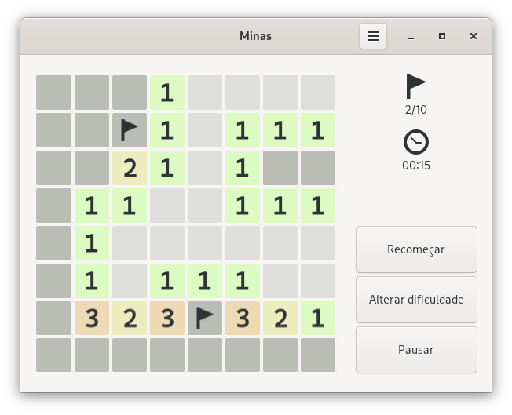

Introdução
==========


## Introdução

A segunda etapa no processo de projeto de funções é a definição de tipos de dados. \pause

Nessa etapa identificamos as informações do problema e como elas serão representadas no programa. \pause

Essa etapa pode ter parecido, até então, muito simples ou talvez até desnecessária, isto porque as informações que precisávamos representar eram "simples". \pause

No entanto, essa etapa é muito importante no projeto de programas, de fato, vamos ver que para muitos casos, os tipos de dados vão guiar o restante das etapas do projeto. \pause

Vamos começar com a definição do que é um tipo de dado.


## Definição

Um **tipo de dado** é um conjunto de valores que uma variável pode assumir. \pause

Exemplos \pause

- Booleano $= \{ verdadeiro, falso \}$ \pause
- Combustível = $\{ alcool, gasolina \}$ \pause
- Natural = $\{ 0, 1, 2, \dots \}$ \pause
- Inteiro = $\{\dots, -2, -1, 0, 1, 2, \dots \}$ \pause
- String = $\{$ '', 'a', 'b', $\dots \}$ \pause
- String que começa com a = $\{$ 'a', 'aa', 'ab', $\dots \}$


## Requisitos de um tipo de dado

Durante a etapa de definição de tipos de dados identificamos as informações e definimos como elas são representadas no programa. \pause

Como determinar se um tipo de dado é adequado para representar uma informação?


## Requisitos de um tipo de dado

Um inteiro é adequado para representar a quantidade de pessoas em um planeta? \pause E um natural? \pause E `unsigned int`{.c} em C? \pause

- Um inteiro não é adequado pois um número inteiro pode ser negativo mas a quantidade de pessoas em um planeta não pode, ou seja, o tipo de dado permite a representação de valores inválidos. \pause

- `unsigned int`{.c} não é adequado pois o valor máximo possível é 4.294.967.295, mas o planeta terra tem mais pessoas que isso, ou seja, nem todos os valores válidos podem ser representados. \pause

- Um natural é adequado. Cada valor do conjunto dos naturais representa um valor válido de informação, e cada possível valor de informação pode ser representado por um número natural.


## Requisitos de um tipo de dado

Diretrizes para projeto de tipos de dados:

- Faça os valores válidos representáveis.

- Faça os valores inválidos irrepresentáveis.


Estruturas
==========


## Introdução

Os tipos de dados que vimos até agora são atômicos, isto é, não podem ser decompostos. \pause

Agora queremos representar dados onde dois ou mais valores devem ficar juntos: \pause

- Registro de um aluno;

- Placar de um jogo de futebol;

- Informações de um produto. \pause

Chamamos estes tipos de dados de **estruturas**.


## Estruturas

Em Racket utilizamos a forma especial `struct`{.scheme} para definir estruturas.

\pause

Vamos definir uma estrutura para representar um ponto em um plano cartesiano.


## Estruturas

<div class="columns">
<div class="column" width="48%">
\small

Definição

```scheme
(struct ponto (x y))
```

\pause

Construção

```scheme
(define p1 (ponto 3 4))

(define p2 (ponto 8 2))
```
</div>
<div class="column" width="48%">

\small

\pause

Seletores

```scheme
> (ponto-x p1)
3
> (ponto-y p1)
4
> (ponto-x p2)
8
```

\pause

Teste de tipo

```scheme
> (ponto? p1)
#t
> (ponto? "ola")
#f
```
</div>
</div>


## Sintaxe de `struct`{.scheme}

Uma aproximação da sintaxe do `struct`{.scheme} é

```scheme
(struct <id-estrutura> (<id-campo-1> ...))
```


## Funções definidas na criação de uma estrutura

<div class="columns">
<div class="column" width="48%">
Funções definidas com `struct`{.scheme}

\small

```scheme
;; Construtor
id-estrutura

;; Predicado que verifica se um objeto
;; é do tipo da estrutura
id-estrutura?

;; Seletores
id-estrutura-id-campo
```
</div>
<div class="column" width="48%">
\pause

Por exemplo, a estrutura

\small

```scheme
(struct ponto (x y))
```

Define as funções

```scheme
;; Construtor
ponto

;; Predicado
ponto?

;; Seletores
ponto-x
ponto-y
```

</div>
</div>


## Funções definidas na criação de uma estrutura

Note que o construtor, o predicado de tipo e os seletores criados por `struct`{.scheme} são funções comuns, e portando são utilizados como todas as outras funções.

```
> (struct ponto (x y))
> ponto
#<procedure:ponto>
> ponto?
#<procedure:ponto?>
> ponto-x
#<procedure:ponto-x>
> ponto-y
#<procedure:ponto-y>
```


## Estruturas transparentes

Por padrão, ao exibir um dado estruturado o interpretador não exibe os campos do dado (para preservar o encapsulamento)

\pause

```scheme
(struct ponto (x y))
```

\pause

```scheme
> (ponto (+ 1 2) 4)
#<ponto>
```


## Estruturas transparentes

Podemos usar a palavra chave `#:transparent`{.scheme} para tornar a estrutura "transparente"

\pause

```scheme
(struct ponto (x y) #:transparent)
```

\pause

```scheme
; mesmo formato de criação e de exibição
> (ponto (+ 1 2) 4)
(ponto 3 4)
```


## Estruturas transparentes e a função `equal?`

Além de mudar a forma que o ponto é exibido, a palavra chave `#:transparent`{.scheme} também altera o funcionamento da função `equal?`


## Estruturas transparentes e a função `equal?`

```scheme
;; Por padrão, dois pontos são iguais se eles são
;; o mesmo ponto.
(struct ponto (x y))

(define p1 (ponto 3 4))
(define p2 (ponto 3 4))

> (equal? p1 p2)
#f
> (equal? p1 p1)
#t
```


## Estruturas transparentes e a função `equal?`

```scheme
;; Com :#transparent, dois pontos são iguais se os seus
;; campos são iguais.
(struct ponto (x y) #:transparent)

(define p1 (ponto 3 4))
(define p2 (ponto 3 4))

> (equal? p1 p2)
#t
> (equal? p1 p1)
#t
```


## Definindo estruturas

Junto com a definição de uma estrutura, também faremos a descrição do propósito e campos da estrutura.


## Definindo estruturas

```scheme
(struct ponto (x y))
;; Ponto representa um ponto no plano cartesiano
;;   x : Número - a coordenada x
;;   y : Número - a coordenada y
```


## Alterando dados estruturados

Podemos utilizar os seletores para consultar o valor de um campo, mas como alterar o valor de um campo? \pause Não tem como! \pause Lembrem-se, estamos estudando o paradigma funcional, onde não existe mudança de estado! \pause

Ao invés de modificar o campo de uma instância da estrutura, criamos uma cópia da instância com o campo alterado.

\pause

Vamos criar um ponto `p2` que é como `p1`, mas com o valor 5 para o campo `y`.

```scheme
> (define p1 (ponto 3 4))
> (define p2 (ponto (ponto-x p1) 5))
> p2
(ponto 3 5)
```


## Alterando dados estruturados

Este método é limitado \pause

- Se a estrutura tem muitos campos e desejamos alterar apenas um campo, temos que especificar a cópia de todos os outros \pause

- Se a estrutura é alterada pela adição ou remoção de campos, então, todas as operações de "cópia" da estrutura no código devem ser alteradas


## Alterando dados estruturados

Racket oferece a forma especial `struct-copy` ([referência](http://docs.racket-lang.org/reference/struct-copy.html)), que facilita este tipo de operação.


## Alterando dados estruturados

```scheme
> (define p1 (ponto 3 4))
> (define p2 (struct-copy ponto p1 [y 5]))
> p2
(ponto 3 5)
```

\pause

```scheme
> (define p3 (struct-copy ponto p2 [x 4]))
> p3
(ponto 4 5)
```

\pause

```scheme
> ; podemos especificar o novo valor de mais de um campo
> ; não faz sentido para ponto... mas vale o exemplo!
> (define p4 (struct-copy ponto p2 [y 9] [x 6]))
> p4
(ponto 6 9)
```


## Exemplo: distância

Defina uma função que calcule a distância de um ponto a origem.


## Exemplo: distância

\small

```scheme
;; Ponto -> Número
;; Calcula a distância do ponto p a origem.
;; A distância de um ponto (x, y) até a origem é calculada
;; pela raiz quadrada de x^2 + y^2.
(examples
 (check-equal? (distancia-origem (ponto 0 7)) 7)
 (check-equal? (distancia-origem (ponto 1 0)) 1)
 ;; (sqrt (+ (sqr 3) (sqr 4))
 (check-equal? (distancia-origem (ponto 3 4)) 5))
(define (distancia-origem p) 0)
```

\pause

```scheme
(define (distancia-origem p)
  (sqrt (+ (sqr (ponto-x p))
           (sqr (ponto-y p)))))
```


Enumerações
===========


## Exemplo contagem

Em um sistema de enquete cada possível resposta é identificada por uma cor: verde, vermelho, azul ou branco. Após todos os participantes responderem a enquete, é necessário contabilizar a quantidade de vezes que cada resposta foi selecionada. Como parte desse sistema, você deve projetar uma função que receba a contabilização atual das respostas e uma nova resposta e produza a contabilização atualizada.


## Exemplo contagem

Análise \pause

- Atualizar a contabilização de repostas considerando um nova resposta. \pause

- Uma resposta pode ser verde, vermelho, azul ou branco. \pause

Definição de tipos de dados \pause

- As informações são a contabilização dos votos e a resposta.


## Definição de tipos de dados

Como representar uma resposta que pode ser verde, vermelho, azul ou branco? \pause

Enumerando os seus valores em um tipo enumerado. \pause

Embora o Racket não suporte a definição de tipos enumerados, podemos registrar em forma de comentários os possíveis valores de um "tipo". \pause

```scheme
;; Resposta é um dos valores:
;; - "verde"
;; - "vermelho"
;; - "azul"
;; - "branco"
```


## Definição de tipos de dados

Como representar a contabilização de votos? \pause

Com uma estrutura com um campo para contar a quantidade de cada tipo de resposta. \pause

```scheme
(struct contagem (verde vermelho azul branco) #:transparent)
;; Uma contagem das respostas de cada cor
;;   verde   : Número - número de respostas verde
;;   vermelho: Número - número de respostas vermelho
;;   azuli   : Número - número de respostas azul
;;   branco  : Número - número de respostas branco
```


## Especificação

\small

```scheme
;; Resposta Contagem -> Contagem
;; Atualiza a contagem cont considerano a nova resposta res.
(define (atualiza-contagem res cont) ...)
```

\pause

Exemplos \pause

```scheme
(examples
 (check-equal? (atualiza-contagem "verde" (contagem 4 5 1 2))
               (contagem 5 5 1 2))
```
\pause

```scheme
               ;; (struct-copy contagem (contagem 4 5 1 2)
               ;;              [verde (add1 (contagem-verde (contagem 4 5 1 2)))])
```

\pause

```scheme
 (check-equal? (atualiza-contagem "vermelho" (contagem 4 5 1 2))
               (contagem 4 6 1 2))
 ...
```


## Especificação

Quantos exemplos são necessários para funções que processam valores de tipos enumerados? \pause Pelo menos um para cada valor da enumeração. \pause

Como iniciamos a implementação de uma função que processa um valor de tipo enumerado? \pause Criando um caso para cada valor da enumeração.


## Implementação

\small

```scheme
(define (atualiza-contagem res cont)
  (cond
    [(equal? res "verde")

                                                            ]
    [(equal? res "vermelho")

                                                            ]
    [(equal? res "azul")

                                                            ]
    [(equal? res "branco")

                                                            ]))
```

\pause

Como procedemos agora? \pause Generalizando a forma de resposta para os exemplos com a mesma resposta.


## Implementação

\small

```scheme
(define (atualiza-contagem res cont)
  (cond
    [(equal? res "verde")
     (struct-copy contagem
                  cont [verde (add1 (contagem-verde cont))])]
    [(equal? res "vermelho")
     (struct-copy contagem
                  cont [vermelho (add1 (contagem-vermelho cont))])]
    [(equal? res "azul")
     (struct-copy contagem
                  cont [azul (add1 (contagem-azul cont))])]
    [(equal? res "branco")
     (struct-copy contagem
                  cont [branco (add1 (contagem-branco cont))])]))
```

\ 


## Exemplo - Campo minado

Campo minado é um famoso jogo de computador. O jogo consiste de um campo retangular de quadrados que podem ser abertos clicando sobre eles. Em alguns quadrados estão escondidos minas, o objetivo do jogo é abrir todos os quadrados que não têm minas. Se o jogador abrir um quadrado com uma mina, o jogo termina e o jogador perdei.

Como guia para explorar o campo, cada quadrado aberto exibe o número de minas nos quadrados ao seu redor (no máximo 8). Quando um quadrado sem minas ao redor é aberto, todos os quadrados ao seu redor também são aberto; O usuário pode colocar uma bandeira sobre um quadrado fechado para sinalizar uma possível mina e impedir que ele seja aberto. Uma bandeira também pode ser removida de um quadrado.


## Exemplo - Campo minado

{width=7cm}

Projete um tipo de dado para representar um quadrado em um jogo de campo minado. Não é necessário armazenar o número de bombas ao redor do quadrado pois esse valor pode ser calculado dinamicamente.


## Exemplo - Campo minado

Em uma primeira tentativa poderíamos pensar: o quadrado pode ter uma mina ou não, pode estar fechado ou aberto e pode ter uma bandeira ou não. \pause Como são três item relacionados, vamos definir uma estrutura. Além disso, cada item tem dois estados possíveis, então vamos usar booleano para representar cada item. \pause

```scheme
(struct quadrado (mina? aberto? bandeira?))
;; Representa um quadrado no jogo campo minado
;;  mina?    : Bool - #t se tem uma mina no quadrado, #f caso contrário
;;  aberto?  : Bool - #t se o quadrado está aberto, #f caso contrário
;;  bandeira?: Bool - #t se tem uma bandeira no quadrado, #f caso contrário
```


## Exemplo - Campo minado

Nós vimos duas diretrizes para o projeto de tipo de dado

- Faça os valores válidos representáveis.

- Faça os valores inválidos irrepresentáveis. \pause

A definição de `quadrado` está de acordo com essas diretrizes? \pause Vamos verificar! \pause

Quantas possíveis instâncias distintas existem de `quadrado`? \pause São três campos, cada um pode assumir dois valores, portanto, $2 \times 2 \times 2 = 8$. \pause

Vamos listar essas instâncias e analisar se todas são válidas.


## Exemplo - Campo minado

<div class="columns">
<div class="column" width="48%">

\small

| `mina?`       | `aberto?`      | `bandeira?`    | Válido?       |
|:-------------:|:--------------:|:--------------:|:-------------:|
| `#f`{.scheme} | `#f`{.scheme}  | `#f`{.scheme}  | \pause Sim \pause |
| `#f`{.scheme} | `#f`{.scheme}  | `#t`{.scheme}  | \pause Sim \pause |
| `#f`{.scheme} | `#t`{.scheme}  | `#f`{.scheme}  | \pause Sim \pause |
| `#f`{.scheme} | `#t`{.scheme}  | `#t`{.scheme}  | \pause Não \pause |
| `#t`{.scheme} | `#f`{.scheme}  | `#f`{.scheme}  | \pause Sim \pause |
| `#t`{.scheme} | `#f`{.scheme}  | `#t`{.scheme}  | \pause Sim \pause |
| `#t`{.scheme} | `#t`{.scheme}  | `#f`{.scheme}  | \pause Sim \pause |
| `#t`{.scheme} | `#t`{.scheme}  | `#t`{.scheme}  | \pause Não        |

\pause

Temos dois estados inválidos!

</div>
<div class="column" width="48%">
\pause
Como evitar estes estados inválidos? \pause Primeiro temos que entender o problema. \pause

A questão é que apenas 3 das 4 possíveis combinações dos valores dos campos `aberto?` e `banderira?` são válidos: aberto, fechado ou com bandeira. \pause

Para resolver a situação podemos "juntar" os campo `aberto?` e `bandeira?` em um campo `estado` que pode assumir um desses três valores.
</div>
</div>


## Exemplo - Campo minado

\small

```scheme
;; Estado é um dos valores
;; - "aberto"
;; - "fechado"
;; - "com-bandeira"

(struct quadrado (mina? estado))
;; Representa um quadrado no jogo campo minado
;;  mina? : Bool - #t se tem uma mina no quadrado, #f caso contrário
;;  estado: Estado - o estado do quadrado
```

\pause

Quantas possíveis instâncias distintas existem de `quadrado`? \pause O campo `mina?` pode assumir dois valores e o campo `estado` 3, portanto, $2 \times 3 = 6$, que são os seis estados válidos que identificamos anteriormente.


## Exemplo - Ação campo minado

Agora que temos uma representação adequada para um quadrado, podemos avançar e projetar uma função que determina como um quadrado irá ficar após a ação de um usuário. O usuário pode fazer uma ação para abrir um quadrado, adicionar uma bandeira ou remover uma bandeira.


Uniões
======


## Problema - Estado tarefa

Projete uma função que exiba uma mensagem sobre o estado de uma tarefa. Uma tarefa pode estar em execução, ter sido concluída em um tempo específico e com um mensagem de sucesso, ou ter falhado com um código e uma mensagem de erro.

\pause

Como representar o estado de uma tarefa? \pause

Vamos tentar uma estrutura.


## Problema - Estado tarefa

\small

```scheme
(struct estado-tarefa (executando tempo msg_sucesso codigo_err msg_err))
;; Representa o estado de uma tarefa
;; executando: Bool - #t se a tarefa está em execução, #f caso contrário
;; tempo: Número - tempo que durou a execução da tarefa
;; msg_sucesso: String - mensagem caso a tarefa tenha sido executada com sucesso
;; codigo_err: Número - código de erro se a execução da tarefa falhou
;; msg_err: String - mensagem de erro se a execução da tarefa falhou
```

\normalsize

\pause

Qual é o problema dessa representação? \pause

Possíveis estados inválidos. \pause O que significa `(estado-tarefa #t 10 "Ótimo desempenho" 123 "Falha na conexão")`{.scheme}? \pause

Como evitar esse problema?


## Problema - Estado tarefa

Analisando a descrição do problema conseguimos separar o estado da tarefa em três casos: \pause

- Em execução \pause
- Sucesso, com um tempo e uma mensagem \pause
- Falhado, com um código e uma mensagem \pause

Esses casos são excludentes, ou seja, se a tarefa se enquadra em um deles, não devemos armazenar informações sobre os outros (caso contrário, seria possível criar um estado inconsistente). \pause

E como expressar esse tipo de dado? \pause Usando união de tipos.


## Uniões e Estruturas

Vamos ver uma analogia para nos auxilar a entender o conceito de união. \pause

Se consideramos um tipo de dado como um conjunto de possíveis valores daquele tipo, então podemos dizer que: \pause

- Os valores possíveis para um tipo definido por uma estrutura (tipo produto) é o produto cartesiano dos valores possíveis de cada um do seus campos; \pause

- Os valores possíveis para um tipo definido por uma união (tipo soma) é a união dos valores de cada tipo (classe de valores) da união. \pause

Antes de vermos como expressar uniões em Racket, vamos ver como uniões funcionam em um sistema estático de tipo (discutido em sala).


## Definição de tipos de dados

Agora podemos prosseguir com o projeto do programa em Racket. \pause Antes de definir o tipo que representa o estado da tarefa, precisamos definir os tipos para sucesso e erro. \pause

\small

```scheme
(struct sucesso (tempo msg))
;; Representa o estado de uma tarefa que finalizou a execução com sucesso
;; tempo: Número - tempo de execução em segundos
;; msg  : String - mensagem de sucesso gerada pela tarefa

(struct erro (codigo msg))
;; Representa o estado de uma tarefa que finalizou a execução com falha
;; código: Número - o código da falha
;; msg   : String - mensagem de erro gerada pela tarefa
```

## Definição de tipos de dados

Agora podemos definir o tipo para estado da tarefa como uma união de três casos:

\small

```scheme
;; EstadoTarefa é um dos valores:
;; - "Executando"             A tarefa está em execução
;; - (sucesso Número String)  A tarefa finalizou com sucesso
;; - (erro Número String)     A tarefa finalizou com falha
```


## Especificação

\small

```scheme
;; EstadoTarefa -> String
;; Produz uma string amigável para o usuário para descrever o estado da tarefa.
(define (msg-usuario estado) "")
```

\pause

Quantos exemplos são necessários? \pause Pelo menos um para cada classe de valor. \pause (Note que o exercício não é muito específico sobre a saída (o foco é no projeto de dados), por isso usamos a criatividade para definir a saída) \pause

```scheme
(examples
 (check-equal? (msg-usuario "Executando")
               "A tarefa está em execução.")
 (check-equal? (msg-usuario (sucesso 12 "Os resultados estão corretos"))
               "Tarefa concluída (12s): Os resultados estão corretos.")
 (check-equal? (msg-usuario (erro 123 "Número inválido '12a'"))
               "A tarefa falhou (err 123): Número inválido '12a'."))
```


## Implementação

Mesmo sem saber detalhes da implementação, podemos definir a estrutura do corpo da função baseado apenas no tipo do dado, no caso, `EstatoTarefa`. \pause São três casos, dependendo do caso, podemos usar seletores específicos.

## Uniões

\small

```scheme
(define (msg-usuario estado)
  (cond
    [(and (string? estado) (string=? estado "Executando"))
    ]
    [(sucesso? estado)
     ... (sucesso-tempo estado)
     ... (sucesso-msg estado)
    ]
    [(erro? estado)
     ... (erro-codigo estado)
     ... (erro-msg estado)
    ]))
```


## Implementação

\small

```scheme
(define (msg-usuario estado)
  (cond
    [(and (string? estado) (string=? estado "Executando"))
     "A tarefa está em execução."]
    [(sucesso? estado)
     (format "Tarefa concluída (~as): ~a."
             (sucesso-tempo estado)
             (sucesso-msg estado))]
    [(erro? estado)
     (format "A tarefa falhou (err ~a): ~a."
             (erro-codigo estado)
             (erro-msg estado))]))
```


## Uniões em Racket tipado (typed racket)

As uniões no racket sem tipagem estática de dados são muito flexiveis.
A linguagem racket possui uma variante com tipagem estática de dados, a qual permite que as uniões sejam mais restritas. 

## Uniões em Racket tipado (typed racket)
```scheme
#lang typed/racket

(struct sucesso ([duracao : Number]
                 [msg : String]))

(struct erro ([codigo : Number]
              [msg : String]))

(define-type EstadoTarefa (U sucesso erro "Executando"))
```
## Uniões em Racket tipado (typed racket)

```scheme

(: mensagem (-> EstadoTarefa String))
(define (mensagem estado)
  (cond
    [(string? estado) 
     "A tarefa está em execução"]
    [(sucesso? estado)
     (format "A tarefa finalizou com sucesso (~as): ~a."
             (sucesso-duracao estado)
             (sucesso-msg estado))]
    [(erro? estado)
     (format "A tarefa falhou (erro ~a): ~a."
             (erro-codigo estado)
             (erro-msg estado))]))
```


Outras linguagens
=================


## União em outras linguagens

A união de tipos é bastante útil e com a popularização da programação funcional, também tem sido adicionada a diversas linguagens de programação. Vamos ver algumas delas.


## Uniões em Python

\small

```python
from dataclasses import dataclass
from typing import Literal

@dataclass
class Sucesso:
    duracao: int
    msg: str

@dataclass
class Erro:
    codigo: int
    msg: str

EstadoTarefa = Literal["Executando"] | Sucesso | Erro
```


## Uniões em Python

\small

```python
def mensagem(estado: EstadoTarefa) -> str:
    if isinstance(estado, str):
        return 'A tarefa está em execução'
    elif isinstance(estado, Sucesso):
        return 'A tafera finalizou com sucesso ({}s): {}'.format(estado.duracao,
                                                                 estado.msg)
    else:
        return 'A tafera falhou (error {}): {}'.format(estado.codigo, estado.msg)
```


## Uniões em Python

\small

```python
def mensagem(estado: EstadoTarefa) -> str:
    match estado:
        case str(estado):
            return 'A tarefa está em execução'
        case Sucesso(duracao, msg):
            return f'A tafera finalizou com sucesso ({duracao}s): {msg}'
        case Erro(codigo, msg):
            return f'A tafera falhou (error {codigo}): {msg}'
```


## Uniões em Rust

\small

```rust
pub enum EstadoTarefa {
    Executando,
    Sucesso(u32, String),
    Erro(u32, String),
}
pub fn mensagem(estado: &EstadoTarefa) -> String {
    match estado {
        EstadoTarefa::Executando =>
            "A tarefa está em execução".to_string(),
        EstadoTarefa::Sucesso(tempo, msg) =>
            format!("A tarefa finalizou com sucesso ({tempo}s): {msg}"),
        EstadoTarefa::Erro(codigo, msg) =>
            format!("A tarefa falhou (erro {codigo}): {msg}"),
    }
}
```


## Uniões em Java

\small

```java
sealed interface EstadoTarefa permits Executando, Sucesso, Erro {};
record Executando() implements EstadoTarefa {};
record Sucesso(int tempo, String sucesso) implements EstadoTarefa {};
record Erro(int erro, String msg) implements EstadoTarefa {};

static String mensagem(EstadoTarefa estado) {
    return switch (estado) {
        case Executando e ->
            "A tarefa está executando";
        case Sucesso s ->
            String.format("A tarefa foi concluída (%ds): %s", s.tempo(), s.sucesso());
        case Erro e ->
            String.format("A tarefa falhou (erro %d): %s", e.erro(), e.msg());
    };
}
```


## Revisão

Vimos duas formas diferentes de definir novos tipos de dados: \pause

- Estruturas: quando diversos valores relacionados são agrupados para representar uma entidade \pause

- Uniões: quando uma entidade é descrita pela união de diversas classes de valores \pause

No contexto de programação funcional, essas construções de tipos são chamadas de tipos de dados algébricos \pause

- As estruturas são chamadas de tipos produto \pause

- As uniões são chamadas de tipos somas \pause

Essa "analogia" com a álgebra é interessante pois nos permite entender mais facilmente alguns aspectos da construção de tipos.


Referências
===========

## Referências

Básicas

- [Vídeos Compound Data](https://www.youtube.com/playlist?list=PL6NenTZG6KrpA-ww35EwcaxY-tgh82TAh)

- [Vídeos Reference](https://www.youtube.com/watch?v=tp44seRHLUQ&list=PL6NenTZG6KrptkOEMyLWDnF0ZjSpVTHAE)

- Seções [5.1](http://docs.racket-lang.org/guide/define-struct.html) do [Guia Racket](http://docs.racket-lang.org/guide/)


Complementares

- Seções [4.1](http://docs.racket-lang.org/reference/structures.html) da [Referência Racket](http://docs.racket-lang.org/reference/)

Leitura recomendada

- [Expression problem](https://en.wikipedia.org/wiki/Expression_problem)

-->
