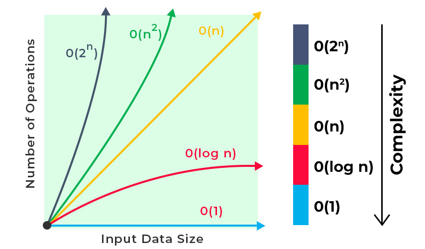

Introdução
==========

## Introdução

Quais foram as nossas preocupações até agora no projeto de programas? \pause

- Identificar o problema \pause

- Resolver o problema com código bem escrito e testado \pause

O que exatamente significa dizer que um programa resolve um problema? \pause

- Que o programa produz a resposta esperada para todas as entradas.

\pause

Isso é suficiente? \pause Não! \pause O programa deve produzir as respostas esperadas consumindo uma quantidade aceitável de recursos (tempo, memória, etc). \pause

Como determinar a quantidade de recursos que um algoritmo (programa, função) consome? \pause Fazendo a análise do algoritmo.


## Análise de algoritmos

A **análise de algoritmos** é o processo de encontrar a complexidade computacional dos algoritmos, isto é, a quantidade de recursos (tempo, memória, etc) necessários para executá-los. \pause

A análise pode ser feita de forma teórica ou experimental, e o resultado da análise é geralmente expresso por uma função que relaciona o tamanho da entrada do algoritmo com o número de passos (complexidade de tempo) ou com o número de células de memória (complexidade de espaço) necessários para executar o algoritmo.


## Análise teórica

Na **análise teórica** adotamos uma máquina teórica de computação e expressamos a complexidade de um algoritmo através de uma **função que relaciona o tamanho da entrada com o consumo de recursos** nessa máquina teórica. \pause

A máquina teórica que vamos adotar tem operações lógicas e aritméticas, cópia de dados e controle de fluxo, e tem as seguintes características: \pause

- As instruções são executadas uma por vez e em sequência; \pause

- Cada operação é executa em uma unidade de tempo.


## Exemplo - soma

<div class="columns">
<div class="column" width="45%">
\small

```{.python .number-lines}
def soma(lst: list[int]) -> int:
    s = 0
    i = 0
    while i < len(lst):
        s = s + lst[i]
        i = i + 1
    return s
```

\pause

Qual é a complexidade de tempo da função `soma`? \pause Ou, quanto tempo a função `soma` consome? \pause Ou, quantas instruções a função executa? \pause Depende da quantidade $n$ de elementos de `lst`.

\pause


</div>
<div class="column" width="50%">

\small

Vamos "contar" as instruções \pause

- linha 2: \pause 1 instrução \pause
- linha 3: \pause 1 instrução \pause
- linha 4: $(n + 1) \times$
  - 1 instrução para comparação \pause
  - umas 3 instruções para executar `len` \pause
- linha 5: \pause $n \times$ umas 3 instruções \pause
- linha 6: \pause $n \times$ 2 instruções \pause
- linha 7: \pause 1 instrução \pause

Total: \pause $9n + 7$ \pause

Portanto, a complexidade de tempo de `soma` é $T(n) = 9n + 7$.

</div>
</div>


## Análise teórica

Em geral, não estamos procurando uma função precisa para a complexidade de um algoritmo, mas uma que descreve de forma razoável como o consumo do recurso cresce em relação ao crescimento do tamanho da entrada, o que chamamos de **ordem de crescimento**. \pause

Além disso, estamos interessados em entradas suficientemente grandes, para que o algoritmo demore algum tempo razoável para executar e não termine rapidamente. \pause

Por esse motivo, em alguns casos, podemos fazer simplificações na análise, como por exemplo, levar em consideração apenas as **operações que são mais executadas**.


## Exemplo - soma

<div class="columns">
<div class="column" width="48%">
\scriptsize

```python
def soma(lst: list[int]) -> int:
    s = 0
    i = 0
    while i < len(lst):
        s = s + lst[i]
        i = i + 1
    return s
```

</div>
<div class="column" width="48%">

Qual é a operação mais executada na função `soma`? \pause A comparação `<`. \pause

Quantas vezes ela é executada? \pause $n + 1$. \pause

Portanto, a complexidade de tempo de `soma` é $T(n) = n + 1$. \pause
</div>
</div>

\ \

\ \

<div class="columns">
<div class="column" width="48%">
\scriptsize

```.gleam
fn soma(lst: List(Int)) -> Int {
  case lst {
    [] -> 0
    [primeiro, ..resto] ->
      primeiro + soma(resto)
  }
}
```

</div>
<div class="column" width="48%">

Qual é a operação mais executada na função `soma`? \pause A comparação de `lst` com `[]`. \pause Ou a operação `+`. \pause Ou a própria chamada da função. \pause

Quantas vezes a função é chamada? \pause $n + 1$. \pause

Portanto, a complexidade de tempo de `soma` é $T(n) = n + 1$.
</div>
</div>


## Crescimento assintótico

Quando olhamos para entradas suficientemente grandes e consideramos relevante apenas a ordem de crescimento, estamos estudando a **eficiência assintótica** do algoritmo em relação ao uso de algum recurso. \pause

Dessa forma, um algoritmo assintoticamente mais eficiente será a melhor escolha, exceto para entradas muito pequenas.


## Notação assintótica

Para expressar e comparar a complexidade de algoritmos, utilizamos a **notação assintótica**. \pause

Vamos ver três notações:

- Notação $O$
- Notação $\Omega$
- Notação $\Theta$


## Notação $O$ -- $O$ grande -- _Big-oh_

A notação $O$ descreve um **limite assintótico superior** para uma função. \pause

Para uma função $g(n)$, denotamos por $O(g(n))$ o conjunto de funções $\{f(n)$: existem constantes positivas $c$ e $n_0$ tal que $0 \le f(n) \le c g(n)$ para todo $n \ge n_0\}$.

\includegraphics[trim=37cm 3cm 37cm 0pt,clip, width=4.5cm]{imagens/Fig-3-1.pdf}

\pause

\center $\displaystyle f(n) \in O(g(n)) \iff \lim_{n \to \infty}\frac{f(n)}{g(n)} = L, \pause 0 \leq L < \infty.$


## Notação $O$ -- $O$ grande -- _Big-oh_

Escrevemos $f(n) = O(g(n))$ para indicar que $f(n) \in O(g(n))$ \pause

Informalmente, dizemos que $f(n)$ cresce no máximo tão rapidamente quanto $g(n)$.


## Exemplos

$n = O(n^{3})$? \pause Sim. \pause

$10000n + 10000 = O(n)$? \pause Sim. \pause

$n^{3} + n^{2} + n = O(n^{3})$? \pause Sim. \pause

$n^3 = O(n^2)$? \pause Não. \pause

$n^3 = O(n^4)$? \pause Sim.


## Notação $\Omega$ -- $\Omega$ grande -- _Big-omega_

A notação $\Omega$ descreve um **limite assintótico inferior** para uma função. \pause

Para uma função $g(n)$, denotamos por $\Omega(g(n))$ o conjunto de funções $\{f(n)$: existem constantes positivas $c$ e $n_0$ tal que $0 \le c g(n) \le f(n)$ para todo $n \ge n_0\}$

\includegraphics[trim=79cm 3cm 0cm 0pt,clip, width=4.5cm]{imagens/Fig-3-1.pdf}

\pause

\center $\displaystyle f(n) \in \Omega(g(n)) \iff \lim_{n \to \infty}\frac{f(n)}{g(n)} = L, \pause 0 < L \le \infty.$


## Notação $\Omega$ -- $\Omega$ grande -- _Big-omega_

Informalmente, dizemos que $f(n)$ cresce no mínimo tão rapidamente quanto $g(n)$. \pause

A notação $\Omega$ é o oposto da notação $O$, isto é $f(n) = O(g(n)) \iff g(n) = \Omega(f(n))$.


## Exemplos

$n^3 \in \Omega(n^2)$? \pause Sim. \pause

$\sqrt n = \Omega(\lg n)$? \pause Sim. \pause

$n^2 + 10n = \Omega(n^2)$? \pause Sim. \pause

$n = \Omega(n^2)$? \pause Não. \pause

$n^2 = \Omega(n)$? \pause Sim.


## Notação $\Theta$

A notação $\Theta$ descreve um **limite assintótico restrito** (justo) para uma função. \pause

Para uma função $g(n)$, denotamos por $\Theta(g(n))$ o conjunto de funções $\{f(n)$: existem constantes positivas $c_1$, $c_2$ e $n_0$ tal que $0 \le c_1 g(n) \le f(n) \le c_2 g(n)$ para todo $n \ge n_0\}$

\includegraphics[trim=0cm 3cm 79cm 0pt,clip, width=4.5cm]{imagens/Fig-3-1.pdf}

\pause

\center $\displaystyle f(n) \in \Theta(g(n)) \iff \lim_{n \to \infty}\frac{f(n)}{g(n)} = L, \pause 0 < L < \infty.$


## Notação $\Theta$

Para duas funções quaisquer $f(n)$ e $g(n)$, temos que $f(n) = \Theta(g(n))$ se e somente se $f(n) = O(g(n))$ e $f(n) = \Omega(g(n))$.


## Exercícios

$100n^2 = \Theta(n^2)$? \pause Sim. \pause

$\frac{1}{2}n^2 -3n = \Theta(n^2)$? \pause Sim. \pause

$3n^2 + 20 = \Theta(n)$? \pause Não. \pause

$6n = \Theta(n^2)$? \pause Não. \pause

$720 = \Theta(1)$? \pause Sim.


## Resumo

Sejam $f(n)$ e $g(n)$ funções, então:

$$\begin{aligned}
f(n) \in O(g(n)) & \iff \lim_{n \to \infty}
\frac{f(n)}{g(n)} = L,  & 0 \leq L < \infty.\\
f(n) \in \Omega(g(n)) & \iff \lim_{n \to \infty}
  \frac{f(n)}{g(n)} = L, &  0 < L \leq \infty.\\
f(n) \in \Theta(g(n)) & \iff \lim_{n \to \infty}
  \frac{f(n)}{g(n)} = L, &  0 < L < \infty.\\
\end{aligned}$$

\pause

Analogia com números reais

\center

$f(n) = O(g(n))$ semelhante a $a \le b$

$f(n) = \Omega(g(n))$ semelhante a $a \ge b$

$f(n) = \Theta(g(n))$ semelhante a $a = b$


## Tempos de execução comuns

| Classe       | Descrição   |
|--------------|-------------|
| $O(1)$       | Constante   |
| $O(\lg n)$   | Logarítmico |
| $O(n)$       | Linear      |
| $O(n \lg n)$ | Log Linear  |
| $O(n^2)$     | Quadrático  |
| $O(n^3)$     | Cúbico      |
| $O(2^n)$     | Exponencial |
| $O(n!)$      | Fatorial    |


## Tempos de execução comuns

{width=10cm}


## Exemplos de análise

Vamos fazer algumas análise e expressar a complexidade usando a notação assintótica.


## Exemplo - contem

<div class="columns">
<div class="column" width="48%">
\scriptsize

```.gleam
/// Devolve True se *v* está em *lst*,
/// False caso contrário.
fn contem(lst: List(Int), v: Int) -> Bool {
  case lst {
    [] -> False
    [primeiro, ..resto] ->
      case v == primeiro {
        True -> True
        False -> contem(resto, v)
      }
  }
}
```

\pause

</div>
<div class="column" width="48%">

Quantas vezes a função é executada? \pause

Depende do valores de entrada! \pause

O tempo de execução de um algoritmo pode depender não apenas do tamanho da entrada, mas do valor específico da entrada. Em outras palavras, para um mesmo _tamanho de entrada_, o tempo de execução pode mudar de acordo com os _valores da entrada_.

</div>
</div>


## Exemplo - contem

<div class="columns">
<div class="column" width="48%">
\scriptsize

```.gleam
/// Devolve True se *v* está em *lst*,
/// False caso contrário.
fn contem(lst: List(Int), v: Int) -> Bool {
  case lst {
    [] -> False
    [primeiro, ..resto] ->
      case v == primeiro {
        True -> True
        False -> contem(resto, v)
      }
  }
}
```

</div>
<div class="column" width="48%">

Quantas vezes a função é executada?

Melhor caso: \pause `v` é primeiro elemento de `lst`. \pause 1 vez. \pause

Pior caso: \pause `v` não está em `lst`. \pause $n + 1$ vezes. \pause

Caso médio: \pause considerando que `v` está em `lst` e tem a mesma probabilidade de ser qualquer elemento de `lst`. \pause $\displaystyle \frac{n + 1}{2}$ \pause

Portanto, o tempo de execução de `contem` no pior caso é `T(n) = O(n)`.

</div>
</div>


## Exemplo - maximo

<div class="columns">
<div class="column" width="48%">
\scriptsize

```.gleam
/// Inverte a ordem dos elementos de *lst*.
fn inverte(lst: List(Int)) -> List(Int) {
  case lst {
    [] -> []
    [primeiro, ..resto] ->
      adiciona_fim(inverte(resto), primeiro)
  }
}

/// Adiciona *n* ao final de *lst*.
fn adiciona_fim(lst, n) {
  case lst {
    [] -> [n]
    [primeiro, ..resto] ->
      [primeiro,
       ..adiciona_fim(resto, n)]
  }
}
```

\pause

</div>
<div class="column" width="48%">

Como proceder com a análise nesse caso? \pause

A função `inverte` é chamada $n + 1$ vezes. Na primeira vez, `lst` tem $n$ elementos, na segunda vez $n-1$, e assim por diante. \pause

Quantas vezes a função `adiciona_fim` é chamada a partir de `inverte`? \pause

Na primeira chamada feita a partir de `inverte`, quantas vezes `adiciona_fim` é executada? \pause $n$ vezes. \pause E na segunda? \pause $n - 1$ vezes. \pause E na última vez? \pause 1 vez.
</div>
</div>


## Exemplo - maximo

<div class="columns">
<div class="column" width="48%">
\scriptsize

```.gleam
/// Inverte a ordem dos elementos de *lst*.
fn inverte(lst: List(Int)) -> List(Int) {
  case lst {
    [] -> []
    [primeiro, ..resto] ->
      adiciona_fim(inverte(resto), primeiro)
  }
}

/// Adiciona *n* ao final de *lst*.
fn adiciona_fim(lst, n) {
  case lst {
    [] -> [n]
    [primeiro, ..resto] ->
      [primeiro,
       ..adiciona_fim(resto, n)]
  }
}
```

</div>
<div class="column" width="48%">
Então, temos que `adiciona_fim` é chamada $\displaystyle n + (n-1) + (n-2) + \cdots 1 \pause= \sum_{i=1}^{n} i \pause= \frac{n(n + 1)}{2}$ vezes. \pause

Portanto, a complexidade de tempo de `inverte` é $T(n) = O(n^2)$.
</div>
</div>


## Equações de recorrências

Apesar de ser possível determinar a complexidade de tempo contando "manualmente" o número de chamadas recursivas, como fizemos para `soma`, `contem` e `inverte`, este processo pode ser mais difícil para outras funções. \pause

Por isso, em geral, usamos uma abordagem mais precisa, que é baseada em equações de recorrências e métodos de resolução de equações de recorrência.


## Equações de recorrência

Uma **equação de recorrência** descreve o tempo de execução de um algoritmo em termos do tempo de execução de outras chamadas do algoritmo. \pause

Essa ideia parece familiar?


## Equações de recorrência

<div class="columns">
<div class="column" width="27%">

\small

Uma **lista** é:

- Vazia;
- Ou não vazia, contendo o primeiro e o resto, que é uma **lista**.

\pause

</div>
<div class="column" width="2%">
</div>
<div class="column" width="30%">

\small

Modelo de função

\ \

\scriptsize

```gleam
fn fn_para_lista(lst) {
  case lst {
    [] -> ...
    [primeiro, ..resto] ->
      primeiro
      ...
      fn_para_lista(resto)
  }
}
```

\pause

</div>
<div class="column" width="41%">

\small

Tempo de execução

$$T(n) =
 \begin{cases}
   c                & \text{se $n = 0$} \\
   T(n - 1) + f(n)  & \text{caso contrário}
  \end{cases}$$

\pause

Onde \pause

- $c$ é o custo do caso base; \pause
- $T(n - 1)$ é o custo da chamada recursiva para o resto; \pause
- $f(n)$ é o custo de combinar a solução para o resto com o primeiro elemento.

</div>
</div>


## Exemplo - soma

<div class="columns">
<div class="column" width="48%">
\scriptsize

```.gleam
fn soma(lst: List(Int)) -> Int {
  case lst {
    [] -> 0
    [primeiro, ..resto] ->
      primeiro + soma(resto)
  }
}
```

</div>
<div class="column" width="48%">

Qual é o custo do caso base? \pause 1. \pause

Qual é o custo da combinação? \pause 1. \pause

Portanto, a equação de recorrência que descreve o tempo de execução de `soma` é:

$$T(n) =
 \begin{cases}
   1             & \text{se $n = 0$} \\
   T(n - 1) + 1  & \text{caso contrário}
  \end{cases}$$

\pause

Ou de forma simplificada, omitindo o caso base

$$T(n) = T(n - 1) + 1$$

</div>
</div>


## Expansão

Como podemos obter o tempo de execução a partir de uma equação de recorrência? \pause

Precisamos resolver a equação de recorrência, isto é, encontrar uma forma fechada, que não seja recursiva. \pause

E como resolver uma equação de recorrência? \pause

Uma maneira é expandir iterativamente as chamadas recursivas substituindo-as pela própria definição até atingir um ponto em que a solução fique clara.


## Expansão

$T(n) = T(n - 1) + 1$ \pause

$T(n) = T(n - 2) + 1 + 1$ \pause

$T(n) = T(n - 3) + 1 + 1 + 1$ \pause

$\dots$ \pause

$T(n) = T(n - n) + \underbrace{1 + \dots + 1}_{n}$ \pause

$T(n) = T(0) + \underbrace{1 + \dots + 1}_{n}$ \pause

$T(n) = 1 + \underbrace{1 + \dots + 1}_{n} \pause = n + 1 \pause = O(n)$


## Exemplo - inverte

<div class="columns">
<div class="column" width="48%">
\scriptsize

```.gleam
/// Inverte a ordem dos elementos de *lst*.
fn inverte(lst: List(Int)) -> List(Int) {
  case lst {
    [] -> []
    [primeiro, ..resto] ->
      adiciona_fim(inverte(resto), primeiro)
  }
}

/// Adiciona *n* ao final de *lst*.
fn adiciona_fim(lst, n) {
  case lst {
    [] -> [n]
    [primeiro, ..resto] ->
      [primeiro,
       ..adiciona_fim(resto, n)]
  }
}
```

\pause

</div>
<div class="column" width="48%">

Qual é o custo do caso base? \pause 1. \pause

Qual é o custo da combinação? \pause $n$ (custo da chamada de `adiciona_fim`). \pause

Portanto, a equação de recorrência que descreve o tempo de execução de `inverte` é:

$$T(n) = T(n - 1) + n$$

</div>
</div>


## Exemplo - inverte

$T(n) = T(n - 1) + n$ \pause

$T(n) = T(n - 2) + (n - 1) + n$ \pause

$T(n) = T(n - 3) + (n - 2) + (n - 1) + n$ \pause

$T(n) = T(n - n) + (n - (n - 1)) + \dots + (n - 2) + (n - 1) + n$ \pause

$\displaystyle T(n) = T(0) + \sum_{i = 1}^{n} n \pause = O(n^2)$


## Exemplo - maior repetição

<div class="columns">
<div class="column" width="48%">
\scriptsize

```gleam
fn maior_repeticao(lst: List(Int)) -> Int {
  case lst {
    [] -> 0
    [primeiro, ..resto] ->
      case frequencia(lst, primeiro) >
              maior_repeticao(resto) {
        True -> frequencia(lst, primeiro)
        False -> maior_repeticao(resto)
      }
  }
}
fn frequencia(lst: List(Int), n: Int) -> Int {
  case lst {
    [] -> 0
    [primeiro, ..resto] if primeiro == n ->
      1 + frequencia(resto, n)
    [primeiro, ..resto] ->
      frequencia(resto, n)
  }
}
```

\pause

</div>
<div class="column" width="48%">

Considerando o caso em que todos os elementos de `lst` são diferentes.

Qual é o custo do caso base? \pause 1. \pause

Qual é o custo da combinação? \pause $n$ (custo de chamar `frequencia`). \pause

Como a função `maior_repeticao` é chamada duas vezes para o resto, a equação de recorrência que descreve o tempo de execução de `maior_repeticao` é:

$$T(n) = 2T(n - 1) + n$$

</div>
</div>


## Exemplo - maior repetição

$T(n) = 2T(n - 1) + n$ \pause

$T(n) = 2(2T(n - 2) + (n - 1)) + n \pause = 4T(n - 2) + 2(n - 1) + n$ \pause

$T(n) = 4(2T(n - 3) + (n - 2)) + 2(n - 1) + 2n \pause = 8T(n - 3) + 4(n - 2) + 2(n - 1) + n$ \pause

$\dots$ \pause

$\displaystyle T(n) = 2^nT(n - n) + \sum_{i = 0}^{n-1} 2^{i}(n - i) \pause \le n2^{n} \pause= O(n2^n)$


## Exemplo - maior repetição

<div class="columns">
<div class="column" width="48%">
\scriptsize

```gleam
fn maior_repeticao(lst: List(Int)) -> Int {
  case lst {
    [] -> 0
    [primeiro, ..resto] ->
      int.max(
        frequencia(lst, primeiro),
        maior_repeticao(resto),
      )
  }
}
fn frequencia(lst: List(Int), n: Int) -> Int {
  case lst {
    [] -> 0
    [primeiro, ..resto] if primeiro == n ->
      1 + frequencia(resto, n)
    [primeiro, ..resto] ->
      frequencia(resto, n)
  }
}
```

\pause

</div>
<div class="column" width="48%">

Qual é o custo do caso base? \pause 1. \pause

Qual é o custo da combinação? \pause $n$ (custo de chamar `frequencia` uma vez). \pause

Portanto, a equação de recorrência que descreve o tempo de execução de `maior_repeticao` é:

$$T(n) = T(n - 1) + n \pause = O(n^2)$$


</div>
</div>


## Referências

Seção 3.1 - Notação assintótica - Algoritmos: Teoria e Prática, 3a. edição, Cormen, T. at all.
